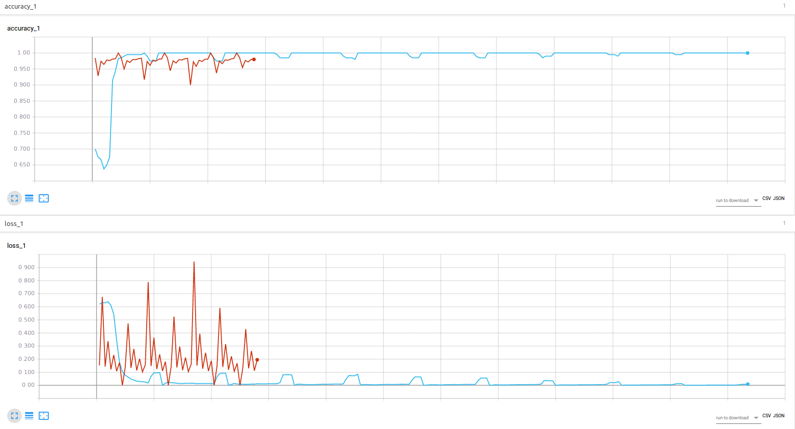
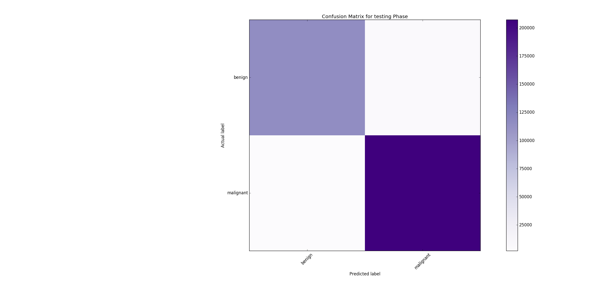

# multilayer-perceptron

_Notice: This repository is now retired, and has been migrated to [GitLab](https://gitlab.com/afagarap/pt-datasets) due to GitHub Copilot._


[](https://www.python.org/downloads/release/python-377/)
[](https://www.python.org/downloads/release/python-382/)
[](https://zenodo.org/badge/latestdoi/106004101)

_This is a part of a recently-concluded research: [On Breast Cancer Detection: An Application of Machine Learning Algorithms on the Wisconsin Diagnostic Dataset](http://arxiv.org/abs/1711.07831) (September 2017 - November 2017)_ [[code](https://github.com/AFAgarap/wisconsin-breast-cancer)].

Multilayer perceptron (MLP) is an artificial neural network with one or more hidden layers. Conventionally, MLP consists of an input layer, at least one hidden or middle layer, then an output layer (Negnevitsky, 2005). Refer to the following figure:


Image from [(Karim, 2016)](https://dzone.com/articles/deep-learning-via-multilayer-perceptron-classifier). A multilayer perceptron with six input neurons, two hidden layers, and one output layer.

This implementation of MLP was written using Python and TensorFlow for binary classification on breast cancer detection using the [Wisconsin diagnostic dataset](<https://archive.ics.uci.edu/ml/datasets/Breast+Cancer+Wisconsin+(Diagnostic)>).

The official dataset information states the following:

```
Features are computed from a digitized image of a fine needle aspirate (FNA) of a breast mass.
They describe the characteristics of the cell nuclei present in the image.
```

The following is the class distribution of the dataset:

| Class     | Number of instances |
| --------- | ------------------- |
| benign    | 357                 |
| malignant | 212                 |

A total of 569 instances. In this implementation, the classes were `{-1, +1}`, representing the benign class and malignant class respectively.

The features included in the dataset are the following:

- radius
- texture
- perimeter
- area
- smoothness
- compactness
- concavity
- concave points
- symmetry
- fractal dimension

Each feature had its (1) mean, (2) standard error, and (3) "worst" or largest (mean of the three largest values) computed. Hence, the dataset having 30 features.

| Variable    | Instances | Shape     |
| ----------- | --------- | --------- |
| x (feature) | 569       | (569, 30) |
| y (label)   | 569       | (569)     |

## Pre-requisites

It is recommended that you have Python 3.x (specifically 3.5 or 3.6) installed in your system. Install the Python libraries specified in the following command to run the program.

```buildoutcfg
sudo pip3 install matplotlib sklearn numpy tensorflow
```

You may opt to use `tensorflow-gpu` instead of `tensorflow`, it's entirely your choice.

## Usage

First, clone the project.

```buildoutcfg
~$ git clone https://github.com/AFAgarap/multilayer-perceptron.git/
```

Program parameters

```buildoutcfg
usage: main.py [-h] -n NUM_EPOCHS -l LOG_PATH -r RESULT_PATH

MLP written using TensorFlow, for Wisconsin Breast Cancer Diagnostic Dataset

optional arguments:
  -h, --help            show this help message and exit

Arguments:
  -n NUM_EPOCHS, --num_epochs NUM_EPOCHS
                        number of epochs
  -l LOG_PATH, --log_path LOG_PATH
                        path where to save the TensorBoard logs
  -r RESULT_PATH, --result_path RESULT_PATH
                        path where to save actual and predicted labels array
```

Then, go to the clone's directory, then run the program with your desired parameters.

```buildoutcfg
~$ cd multilayer-perceptron
~/multilayer-perceptron$ python3 main.py --num_epochs 10000 --log_path ./logs --result_path ./results
```

## Sample Result

The hyper-parameters used in the experiment were assigned by hand, not through hyper-parameter optimization/tuning.

| Hyperparameters | Values      |
| --------------- | ----------- |
| BATCH_SIZE      | 200         |
| EPOCHS          | 10000       |
| LEARNING_RATE   | 1e-2        |
| NODES           | 500-500-500 |

The optimization algorithm used for this implementation of MLP was [stochastic gradient descent (SGD)](https://en.wikipedia.org/wiki/Stochastic_gradient_descent).

Before training and testing, the dataset was standardized using the `sklearn.preprocessing.StandardScaler().fit_transform()` function.

The graph below summarizes the training and testing results. The training accuracy and loss are in color blue, while the testing accuracy and loss are in color red.



The following is the truncated output of training loss and training accuracy for the MLP implementation:

```buildoutcfg
step [100] train -- loss : 0.620643138885498, accuracy : 0.7000000476837158
step [200] train -- loss : 0.6305786371231079, accuracy : 0.675000011920929
step [300] train -- loss : 0.6312072277069092, accuracy : 0.6666667461395264
...
step [22600] train -- loss : 0.007517226040363312, accuracy : 1.0
step [22700] train -- loss : 0.008925976231694221, accuracy : 1.0
EOF -- Training done at step 22749
```

The following is the truncated testing loss and testing accuracy for the MLP implementation:

```buildoutcfg
step [100] test -- loss : 0.15268392860889435, accuracy : 0.984375
step [200] test -- loss : 0.6760536432266235, accuracy : 0.9285714626312256
step [300] test -- loss : 0.14311110973358154, accuracy : 0.9743589758872986
...
step [5500] test -- loss : 0.11166846007108688, accuracy : 0.9799999594688416
step [5600] test -- loss : 0.19539757072925568, accuracy : 0.9799999594688416
```

You can get the following summary of classification statistics by using the module `utils.py`

```buildoutcfg
>>> import utils
>>> test_conf, test_accuracy = utils.plot_confusion_matrix(class_names=['benign', 'malignant'], phase='testing', path='./result_path')
Done appending 0.0% of 5700
Done appending 20.0% of 5700
Done appending 40.0% of 5700
Done appending 80.0% of 5700
Done appending NPY files.
>>> test_conf
array([[115900,   5300],
       [  2100, 207300]])
>>> test_accuracy
0.97761645493042948
```

The confusion matrix `test_conf` may be visualized as follows:



In words, the results were the following:

- True negative : 115900
- False positive : 5300
- False negative : 2100
- True positive : 207300

The actual [TensorBoard log](https://github.com/afagarap/multilayer-perceptron/tree/master/log_path) is also included in this repository

## Citation

To cite the repository/software, kindly use the following BibTex entry:

```
@misc{abien_fred_agarap_2017_1077932,
  author       = {Abien Fred Agarap},
  title        = {AFAgarap/multilayer-perceptron v0.1-alpha},
  month        = dec,
  year         = 2017,
  doi          = {10.5281/zenodo.1077932},
  url          = {https://doi.org/10.5281/zenodo.1077932}
}
```

## License

```buildoutcfg
Feed-Forward Neural Network
Copyright (C) 2017-2021 Abien Fred Agarap

This program is free software: you can redistribute it and/or modify
it under the terms of the GNU General Public License as published by
the Free Software Foundation, either version 3 of the License, or
(at your option) any later version.

This program is distributed in the hope that it will be useful,
but WITHOUT ANY WARRANTY; without even the implied warranty of
MERCHANTABILITY or FITNESS FOR A PARTICULAR PURPOSE.  See the
GNU General Public License for more details.

You should have received a copy of the GNU General Public License
along with this program.  If not, see <https://www.gnu.org/licenses/>.
```

#### References

Michael, N. (2005). Artificial intelligence a guide to intelligent systems.

Karim, M.R. (2016, December 12). Deep learning via multilayer perceptron classifier. Retrieved October 8, 2017 from DZone: https://dzone.com/articles/deep-learning-via-multilayer-perceptron-classifier.
